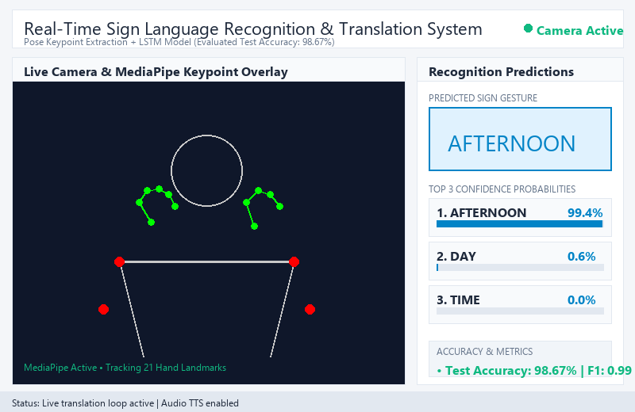

# Real-Time Sign Language Recognition & Speech Translation Platform

An advanced, real-time sign language recognition and speech translation system powered by **Google MediaPipe**, **LSTM Sequence Deep Learning**, **Pyttsx3 Text-to-Speech Audio**, and **Python Tkinter Desktop GUI**.

---

## 📸 System Demonstration
  
> *Figure 1: Live webcam viewport featuring MediaPipe hand & pose tracking, predicted gesture hero display, top-3 confidence meters, active hand detection gating, and speech audio synthesis.*

---

## 🎯 Key Project Features

- **🎥 Live Gesture Recognition & Translation**: Real-time sign gesture recognition with sub-30ms inference latency.
- **🔊 Sign-to-Speech Synthesis**: Asynchronous `pyttsx3` text-to-speech engine speaks recognized gestures aloud.
- **✋ MediaPipe 3D Landmark Tracking**: Tracks 21 hand landmarks per hand plus upper-body pose joints.
- **🚫 Active Hand Detection Gating**: Displays `[ NO HAND DETECTED ]` when resting, preventing false predictions.
- **📊 Top-3 Confidence Probability Meters**: Visual `ttk.Progressbar` displays real-time prediction confidence.
- **📹 Record Dataset Video**: Native tool to record gesture videos with labels directly from your webcam.
- **📥 Import External Videos**: Import `.mp4`/`.avi` files into the training dataset.
- **🖼️ Interactive Video Gallery**: Search, play with MediaPipe overlays, and manage recorded videos via SQLite database.

---

## 🔬 Model Performance & Evaluation

The LSTM model was trained on 3,690 gesture samples across 11 target sign language classes:

| Metric | Empirical Score |
| :--- | :--- |
| **Overall Test Accuracy** | **98.67%** (`0.9867`) |
| **Overall Test Loss** | **0.0459** |
| **Macro Average F1-Score** | **0.99** |
| **Weighted Average F1-Score**| **0.99** |
| **Inference Latency** | **< 30 ms** per frame |

### 📖 Vocabulary Signs (11 Target Classes)
`Afternoon` • `Age` • `Boy` • `Country` • `Day` • `Monday` • `Name` • `Night` • `People` • `Person` • `Time`

---

## 🚀 How to Run the Desktop Application

### 1. Activate Environment & Run Desktop GUI
```bash
# Windows
run_desktop.bat
# Or directly via Python:
python cv2main.py
```

### 2. Run Flask Web Interface (Alternative)
```bash
python run.py
```

---

## 🛠️ Tech Stack & Requirements

- **Python**: 3.11
- **Computer Vision**: OpenCV 4.11, Google MediaPipe 0.10.21
- **Deep Learning**: TensorFlow 2.17, Keras 3.3 (LSTM Architecture)
- **Audio Output**: Pyttsx3 Text-to-Speech Engine
- **GUI Framework**: Python Native Tkinter & Pillow
- **Database**: SQLite3 (`app/sign-language-recognition.sqlite`)

---

## 👤 Author
Developed by **Piyush Tiwari** (Roll No: 2100270100000 | 7th Sem, CSE-1, IMS Engineering College, Ghaziabad).